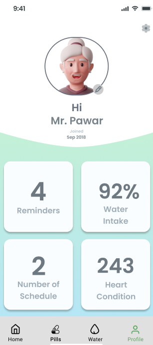
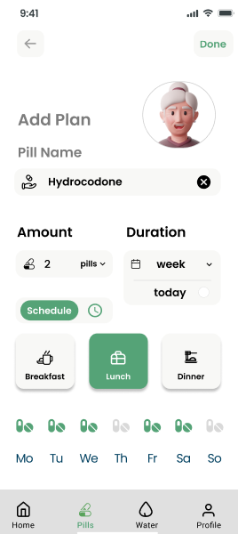
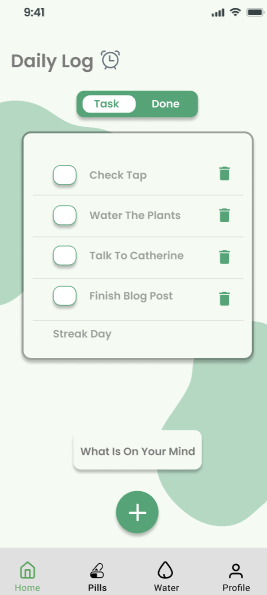

# AgeWell – Elderly Task & Health Reminder App 🧓📱

A React Native app (built with Expo) designed for elderly users to manage their medication, hydration, and daily tasks with ease.

## 🛠️ Tech Stack

- React Native + Expo
- Firebase notifications with haptic/audio feedback
- File-based routing (`app/` structure)

## Screenshots




## 🎯 MVP Highlights

- Daily task checklist (with voice + vibration reminders)
- Medication reminders via visual/audio notifications
- Water intake tracking
- Caretaker access view for remote health data updates

## 👥 Designed For

- Seniors with low tech proficiency or visual impairment
- Caretakers needing remote access to user data

## 🔗 UI/UX Mockups

- [Figma Wireframes](https://www.figma.com/design/Auh85YQvEdPRdrYq5wn0xP/AgeWell?node-id=93-763)
- [Storyboard](https://www.figma.com/board/1NBXNtonFdzkzowCQWEK9X/AgeWell-Storyboard)

## 🚀 Run the App

```bash
npm install
npx expo start
```

> Built with accessibility, clarity, and independence in mind.
